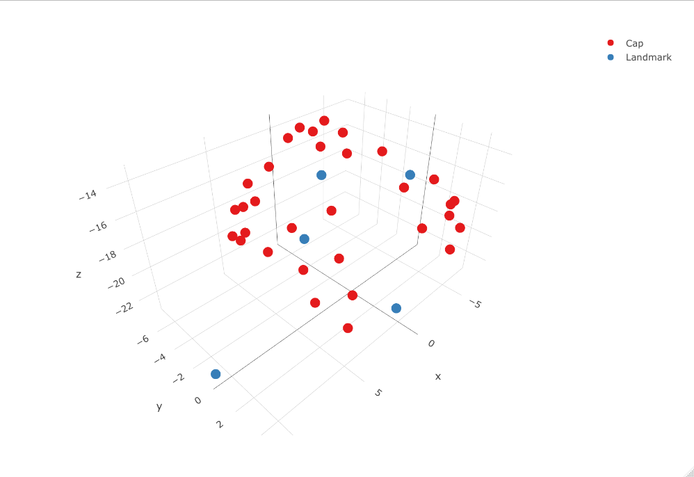
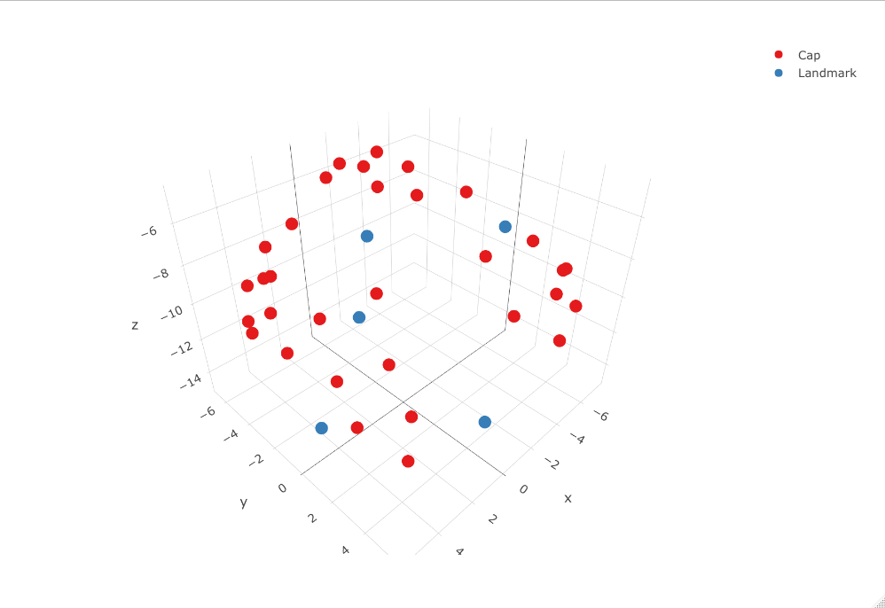

<!-- README.md is generated from README.Rmd. Please edit that file -->

```{r, include = FALSE}
knitr::opts_chunk$set(
  collapse = TRUE,
  eval = F,
  echo = T,
  comment = "#>",
  fig.path = "man/figures/README-",
  out.width = "100%"
)
```

# digitizeR

<!-- badges: start -->
<!-- badges: end -->

The goal of digitizeR is to take digitizations made with a polhemus digitizer, and prepare them for use in image reconstructed fNIRS.

## Installation

You can install the development version from [GitHub](https://github.com/) with:

``` r
# install.packages("devtools")
devtools::install_github("samhforbes/digitizeR")
```
## Example

A csv of participants' cap and head sizes is required, where the first column is ID, second is head size, and third is cap size. If you don't wish to separate by cap size then a single number can be input for cap size for all participants.

Note that the output of polhemus digitizations is assumed to be a txt file with landmarks (5), then sources first, followed by detectors. Numbers are taken in cm rather than inches, and as part of this package converted into mm for use with Homer2.

The usual pipeline for people interested in creating good templates for each cap size will be:
* Load the package

```{r}
library(digitizeR)
```

* Read in the caps (note the type argument, we are working on making this more flexible)

```{r}
#read in caps
capsize <- 'Capsize_Y1.csv'
digipath <- 'Year1_digitisations'
pattern <- 'DIGIFULL'

data  <- read_in_caps(digipath, 
                      pattern, 
                      capsize, 
                      num_source = 12, 
                      num_detector = 20,
                      short = NULL, 
                      subchar = c(1,9))
```

* Select only those with the right number of points (37 in this case)

```{r}
sub_data <- select_caps_by_npoints(data = data, 
                                   npoints = 37)
```

* Create the template

```{r}
templates = prepare_and_make_templates(original_data = sub_data,
                           permitted_dist = 10,
                           npoints = 37)
```

* Then simply save the templates

```{r}
save_templates(template = templates,
               data = sub_data,
               path = 'sam/template_output')
```

There are also plotting functions to visualise the locations of the points.

There are further functions *which are experimental* to then apply all this methodology to individual templates to produce cleaned caps at an individual level. 

First caps would be aligned with the templates for a rough pass

```{r}
aligned_data_final <- align_to_template(templates, sub_data, 37)
```

We can then try one of the individual cap correction methods

```{r}
clean_data3 <- threestep_alignment(templates2, aligned_data_final, sub_data, 37, 12, 10, 7)
```

There are also functions to use different methods, and to save the caps after they are output.

We can test these methods by pulling one point out of each of two templates and pretending they are caps, and when running the threestep alignment we should see that those points *and only those points* are corrected, which we do see!

Note the blue NZ point is pulled forward, and this is then corrected in the second image while all other points remain the same.



